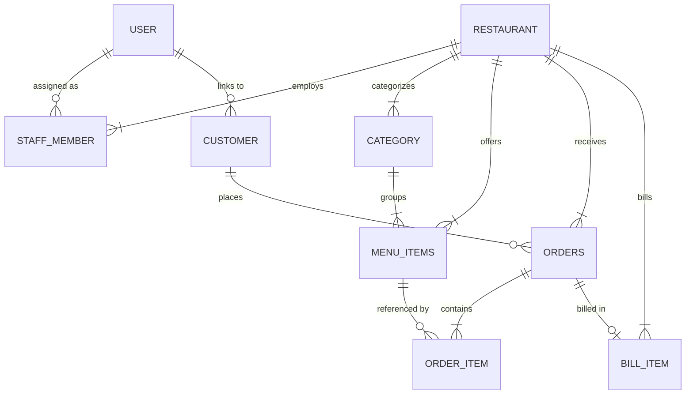

# Yukti (युक्ति) — Integrated Restaurant Management System

[](https://nodejs.org/)
[](https://www.typescriptlang.org/)
[](https://react.dev/)
[](https://vitejs.dev/)
[](https://expressjs.com/)
[](https://www.postgresql.org/)
[](https://typeorm.io/)
[](https://tailwindcss.com/)
[](LICENSE)

**Yukti** is an end-to-end, multi-tenant restaurant operations and management platform designed for diners, restaurant owners, kitchen managers, and platform administrators. It bridges the gap between disparate legacy restaurant systems by unifying digital ordering, live kitchen order management, itemized billing, multi-role staff access, and business analytics into a single web application.

---

## 📑 Table of Contents

- [Problem Statement](#-problem-statement)
- [System Architecture](#-system-architecture)
- [Key Features](#-key-features)
  - [Customer & Guest Experience](#1-customer--guest-experience)
  - [Restaurant Partner & Staff Portal](#2-restaurant-partner--staff-portal)
  - [Platform SuperAdmin Portal](#3-platform-superadmin-portal)
- [Tech Stack](#-tech-stack)
- [Database Entity Design](#-database-entity-design)
- [Repository Structure](#-repository-structure)
- [Getting Started](#-getting-started)
  - [Prerequisites](#prerequisites)
  - [Environment Setup](#1-environment-setup)
  - [Database Setup & Seeding](#2-database-setup--seeding)
  - [Running the Application](#3-running-the-application)
- [API Specification](#-api-specification)
- [Roadmap](#-roadmap)
- [License](#-license)

---

## 💡 Problem Statement

Small-to-medium diners and restaurants often rely on fragmented tools: paper tickets, printed menus, standalone POS machines, and manual spreadsheets for billing and bookkeeping. This results in:
- High operational overhead and human error during rush hours.
- Lost sales insights and lack of customer preference tracking.
- High cost and complexity associated with enterprise-grade solutions.

**Yukti** solves this by providing a unified web platform that is accessible out-of-the-box without specialized hardware or complicated deployment processes.

---

## 🏛 System Architecture

The project is structured as a modern decoupled client-server architecture:

```
                      ┌────────────────────────────────────────┐
                      │             Client (React)             │
                      │  Tailwind CSS v4 + Vite + Radix UI     │
                      └──────────────────┬─────────────────────┘
                                         │  Proxy: /api
                                         ▼
                      ┌────────────────────────────────────────┐
                      │          Backend API (Express)         │
                      │   TypeScript + JWT Cookies + TypeORM   │
                      └──────────────────┬─────────────────────┘
                                         │
                                         ▼
                      ┌────────────────────────────────────────┐
                      │          PostgreSQL Database           │
                      │   Relational Schema + Foreign Keys     │
                      └────────────────────────────────────────┘
```

- **Client (`/client`)**: Single-Page Application (SPA) built with React 19, TypeScript, and Vite. Utilizes Tailwind CSS v4, Lucide icons, and Recharts for interactive analytics.
- **Server (`/server`)**: RESTful API powered by Node.js, Express 5, and TypeScript. Uses TypeORM for entity persistence and PostgreSQL for transactional storage.
- **Authentication**: Stateless JWT authentication stored in HTTP-only cookies with role-based access control (RBAC) across Diners, Staff, Owners, and SuperAdmins.

---

## 🚀 Key Features

### 1. Customer & Guest Experience
- **Digital Menu Browsing**: Browse restaurant storefronts and categorized menus with real-time item availability.
- **Flexible Ordering**: Seamless ordering for both registered users and instant guest sessions (no account required).
- **Live Order Tracking**: Track the status of orders from placement to delivery (`Placed` ➔ `Accepted` ➔ `Preparing` ➔ `Ready` ➔ `Delivered`).
- **Order History**: View past orders and order details.

### 2. Restaurant Partner & Staff Portal
- **Restaurant Onboarding**: Self-service registration workflow for restaurant owners.
- **Menu & Category Management**: Add, update, reorder categories, manage menu items, prices, descriptions, and toggle stock availability in real time.
- **Kitchen & Order Lifecycle Management**: Real-time operational dashboard to inspect active orders and advance kitchen states.
- **Billing & Settlement**: Aggregate table orders into consolidated bills, support multiple payment methods (`Cash`, `Card`, `UPI`), and generate itemized receipts.
- **Role-Based Staff Access**: Manage restaurant team members with assigned roles (`Owner`, `Chef`, `Waiter`, `Manager`).
- **Interactive Business Analytics**: Visual dashboards powered by Recharts detailing revenue trends, top-selling items, order volume distributions, and average ticket size.

### 3. Platform SuperAdmin Portal
- **Platform Analytics**: Comprehensive view of system-wide restaurants, customer accounts, total orders, and cumulative platform revenue.
- **Restaurant Governance**: Inspect details of registered restaurants with the ability to approve, monitor, or temporarily ban/unban establishments.
- **User Directory**: Global user audit and administrative management.

---

## 🛠 Tech Stack

| Layer | Technology | Purpose |
|---|---|---|
| **Frontend Framework** | React 19 + TypeScript | Component-based interactive UI |
| **Build Tool** | Vite 8 | Fast HMR dev server and optimized production bundling |
| **Routing** | React Router v7 | Client-side declarative routing and protected routes |
| **Styling** | Tailwind CSS v4 + Radix UI | Modern responsive design system and accessible UI primitives |
| **Charts** | Recharts | Interactive business analytics dashboards |
| **Icons** | Lucide React | Clean, scalable UI icon set |
| **Backend Framework** | Node.js + Express 5 | Robust RESTful API service |
| **Language** | TypeScript 5 | End-to-end type safety and maintainability |
| **Database** | PostgreSQL | ACID-compliant relational data store |
| **ORM** | TypeORM 1.x | Relational mapping, migrations, and declarative entities |
| **Authentication** | JWT + HTTP-Only Cookies | Secure, stateless authentication and session handling |
| **Security** | bcrypt | Salted password hashing |

---

## 🗄 Database Entity Design

The core relational database model contains 9 primary entities managed via TypeORM:



- **`User`**: System-wide authentication record (`email`, `passwordHash`, `name`, `phone`, `isAdmin`).
- **`Restaurant`**: The central business entity (`name`, `description`, `address`, `phone`, `email`, `openingHours`, `isBanned`, `ownerId`).
- **`StaffMember`**: Staff assignment linking User to Restaurant with role enum (`Owner`, `Chef`, `Waiter`, `Manager`).
- **`Category`**: Menu categorization (`name`, `displayOrder`).
- **`MenuItems`**: Item details (`name`, `price`, `description`, `isAvailable`, `imageUrl`, `sortOrder`).
- **`Customer`**: Session holder for registered or guest users (`userId`, `isGuest`).
- **`Order`**: Order header with tracking status (`Placed`, `Accepted`, `Rejected`, `Preparing`, `Ready`, `Delivered`, `Cancelled`).
- **`OrderItem`**: Historical order snapshot (`itemNameAtOrder`, `priceAtOrder`, `quantity`).
- **`BillItem`**: Payment record linked to orders (`total`, `paymentStatus`, `paymentMethod`, `paidAt`).

---

## 📂 Repository Structure

```text
yukti/
├── client/                     # React 19 + Vite Frontend
│   ├── src/
│   │   ├── api/                # Axios client and API services
│   │   ├── components/         # Reusable UI widgets & ProtectedRoute
│   │   ├── context/            # AuthContext & Session management
│   │   ├── layout/             # Customer, Partner, and Admin layouts
│   │   ├── pages/
│   │   │   ├── admin/          # Platform SuperAdmin portal pages
│   │   │   ├── customer/       # Storefront, Menu, and Order pages
│   │   │   └── partner/        # Restaurant Owner & Staff pages
│   │   ├── types/              # Frontend TypeScript interfaces
│   │   ├── App.tsx             # Route definitions & router provider
│   │   ├── main.tsx            # React application entry point
│   │   └── index.css           # Tailwind CSS base styles
│   ├── package.json
│   └── vite.config.ts          # Vite configuration with /api proxy
│
├── server/                     # Express 5 + TypeORM Backend
│   ├── src/
│   │   ├── controllers/        # Express route controllers
│   │   ├── entities/           # TypeORM database models
│   │   ├── middlewares/        # Auth, RBAC, logger & error handlers
│   │   ├── routes/             # REST route declarations
│   │   ├── scripts/            # CLI utilities (e.g., seedAdmin)
│   │   ├── services/           # Core business and analytics logic
│   │   ├── app.ts              # Express application configuration
│   │   ├── data-source.ts      # TypeORM DataSource configuration
│   │   └── server.ts           # Server bootstrap and database init
│   ├── .env.example
│   ├── package.json
│   └── tsconfig.json
│
├── docs.local/                 # Project planning & initial specifications
├── LICENSE                     # MIT License
└── README.md
```

---

## ⚡ Getting Started

### Prerequisites
- **Node.js**: `v18.0.0` or higher (v20+ recommended)
- **npm**: `v9.0.0` or higher
- **PostgreSQL**: `v14` or higher running locally or hosted

---

### 1. Environment Setup

#### Configure Backend Environment
Navigate to the `server` directory and create a `.env` file:

```bash
cd server
cp .env.example .env
```

Edit `.env` with your PostgreSQL database credentials and JWT secret:

```env
PORT=5000
NODE_ENV=development

# PostgreSQL Database Configuration
DB_HOST=localhost
DB_PORT=5432
DB_USERNAME=postgres
DB_PASSWORD=your_password
DB_NAME=yukti_db

# Authentication
JWT_SECRET=your_super_secret_jwt_key

# Optional SuperAdmin Seeding Defaults
ADMIN_EMAIL=admin@yukti.com
ADMIN_PASSWORD=Admin@123456
```

---

### 2. Database Setup & Seeding

1. **Create the Database in PostgreSQL**:
   ```sql
   CREATE DATABASE yukti_db;
   ```

2. **Install Server Dependencies**:
   ```bash
   cd server
   npm install
   ```

3. **Seed the Platform SuperAdmin**:
   Use the built-in seed utility to bootstrap the first administrative account:
   ```bash
   npm run seed:admin
   ```
   *Custom credentials can also be passed as command line arguments:*
   ```bash
   npm run seed:admin -- --email=myadmin@example.com --password=SecurePassword123 --name="Admin Name"
   ```

---

### 3. Running the Application

#### Step 1: Start the Backend API
In the `server` directory:
```bash
npm run dev
```
The server will initialize the TypeORM connection and listen on `http://localhost:5000`.

#### Step 2: Start the Frontend Client
In a new terminal window, navigate to the `client` directory:
```bash
cd client
npm install
npm run dev
```
The client will start on `http://localhost:5173`. API requests to `/api/*` are automatically proxied to the backend at `http://localhost:5000`.

---

## 📡 API Specification

All endpoints are prefixed with `/api`.

### Authentication & Users
| Method | Endpoint | Access | Description |
|---|---|---|---|
| `POST` | `/users/register` | Public | Register a new user account |
| `POST` | `/users/login` | Public | Log in and receive HTTP-only auth cookie |
| `POST` | `/users/logout` | Authenticated | Clear user session cookie |
| `GET` | `/users/me` | Authenticated | Retrieve current user profile |
| `PUT` | `/users/me` | Authenticated | Update current user profile |
| `GET` | `/users` | SuperAdmin | Fetch all registered users |

### Restaurants & Moderation
| Method | Endpoint | Access | Description |
|---|---|---|---|
| `GET` | `/restaurants` | Public | List all active restaurants |
| `GET` | `/restaurants/:id` | Public | Get single restaurant profile & details |
| `POST` | `/restaurants` | Authenticated | Register a new restaurant (creator becomes Owner) |
| `PUT` | `/restaurants/:id` | Owner | Update restaurant details |
| `DELETE` | `/restaurants/:id` | Owner | Delete restaurant |
| `PATCH` | `/restaurants/:id/ban` | SuperAdmin | Toggle ban/unban status for moderation |
| `GET` | `/restaurants/:id/analytics` | Staff / Owner | Fetch detailed business analytics and KPIs |

### Menu Items & Categories
| Method | Endpoint | Access | Description |
|---|---|---|---|
| `GET` | `/restaurants/:id/categories` | Public | List all categories for a restaurant |
| `POST` | `/restaurants/:id/categories` | Staff / Owner | Create a new menu category |
| `PUT` | `/restaurants/:id/categories/:categoryId` | Staff / Owner | Update a category |
| `DELETE` | `/restaurants/:id/categories/:categoryId` | Owner | Delete a category |
| `GET` | `/restaurants/:id/menu-items` | Public | List all menu items for a restaurant |
| `POST` | `/restaurants/:id/menu-items` | Staff / Owner | Add a new menu item |
| `PATCH` | `/restaurants/:id/menu-items/:menuItemId` | Staff / Owner | Update item details or toggle availability |
| `DELETE` | `/restaurants/:id/menu-items/:menuItemId` | Owner | Delete a menu item |

### Orders & Kitchen Lifecycle
| Method | Endpoint | Access | Description |
|---|---|---|---|
| `POST` | `/restaurants/:id/orders` | Public / Guest | Place a new customer order |
| `GET` | `/restaurants/:id/orders` | Staff / Owner | View all incoming and active kitchen orders |
| `GET` | `/restaurants/:id/orders/:orderId` | Customer / Staff | Get full order details and line items |
| `PATCH` | `/restaurants/:id/orders/:orderId/status` | Staff / Owner | Advance order status (`Accepted`, `Preparing`, etc.) |

### Billing & Payment Settlement
| Method | Endpoint | Access | Description |
|---|---|---|---|
| `POST` | `/restaurants/:id/bills` | Customer / Staff | Generate a bill for an order |
| `GET` | `/restaurants/:id/bills` | Staff / Owner | View all bills for a restaurant |
| `GET` | `/restaurants/:id/bills/open` | Public / Staff | Fetch active unbilled orders |
| `GET` | `/restaurants/:id/bills/:billId` | Public / Staff | Retrieve an itemized bill receipt |
| `PATCH` | `/restaurants/:id/bills/:billId/payment` | Staff / Owner | Settle bill (`Paid` status with Cash/Card/UPI) |
| `DELETE` | `/restaurants/:id/bills/:billId` | Owner | Void a bill |

### Staff Management
| Method | Endpoint | Access | Description |
|---|---|---|---|
| `GET` | `/restaurants/:id/staff` | Owner | List all staff members for a restaurant |
| `GET` | `/restaurants/:id/staff/:staffId` | Owner | Get specific staff member details |
| `POST` | `/restaurants/:id/staff` | Owner | Add a staff member (`Owner`, `Chef`, `Waiter`, `Manager`) |
| `PATCH` | `/restaurants/:id/staff/:staffId` | Owner | Update staff member role or status |
| `DELETE` | `/restaurants/:id/staff/:staffId` | Owner | Remove a staff member |

### Customers & Guest Sessions
| Method | Endpoint | Access | Description |
|---|---|---|---|
| `POST` | `/customers/guest` | Public | Create a lightweight guest ordering session |
| `GET` | `/customers/:id` | Public | Fetch customer session information |
| `GET` | `/customers/:id/orders` | Customer | Fetch orders placed under a customer session |

---

## 🔮 Roadmap

- [x] Multi-tenant restaurant registration & owner workflow
- [x] Real-time menu and category management
- [x] Order lifecycle tracking and kitchen pipeline
- [x] Bill settlement with multiple payment modes (Cash, Card, UPI)
- [x] SuperAdmin moderation and platform-wide monitoring
- [x] Sales analytics and visual performance reports
- [ ] **Table-Specific QR Code Generation**: Instant table assignment via dynamic QR scan
- [ ] **Real-time Notifications**: WebSockets / SSE for instant kitchen order alerts
- [ ] **Customer Loyalty & Discount Coupons**: Promotional campaigns and repeat diner discounts
- [ ] **Direct Cloud Media Uploads**: Integrated S3 / Cloudinary image uploads for logos and dish photos

---

## 📄 License

This project is licensed under the [MIT License](LICENSE).

---

## 👨‍💻 Author

**Kunj Vipul Goyal**  
IIT Madras — BS Degree Program  
*Course: Application Development Lab (CS4010)*
